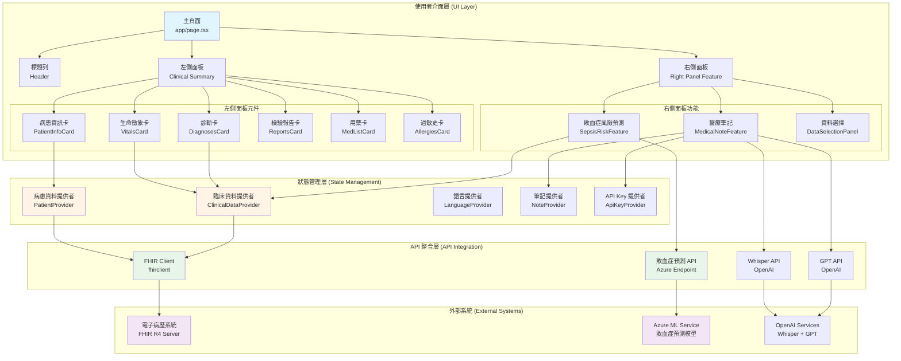
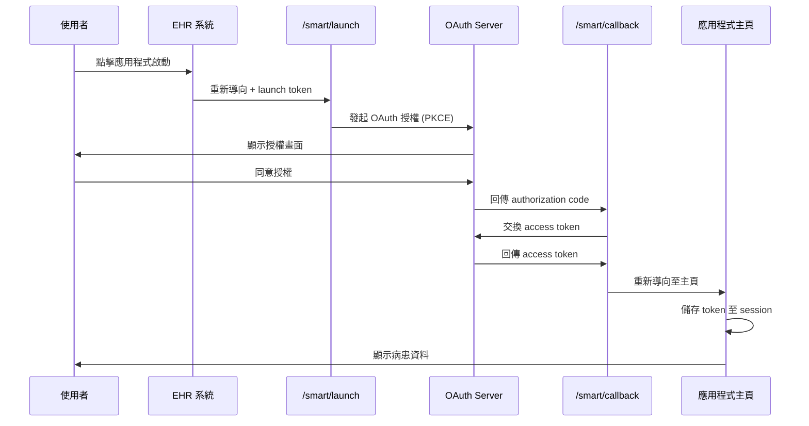
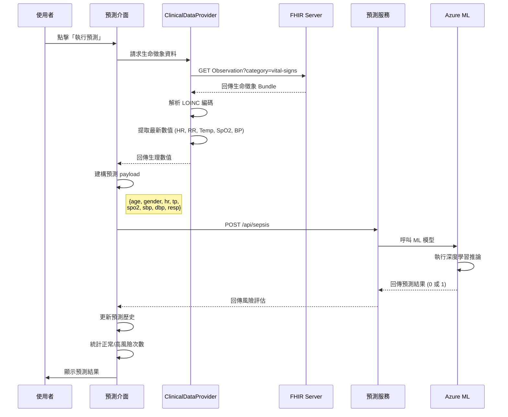
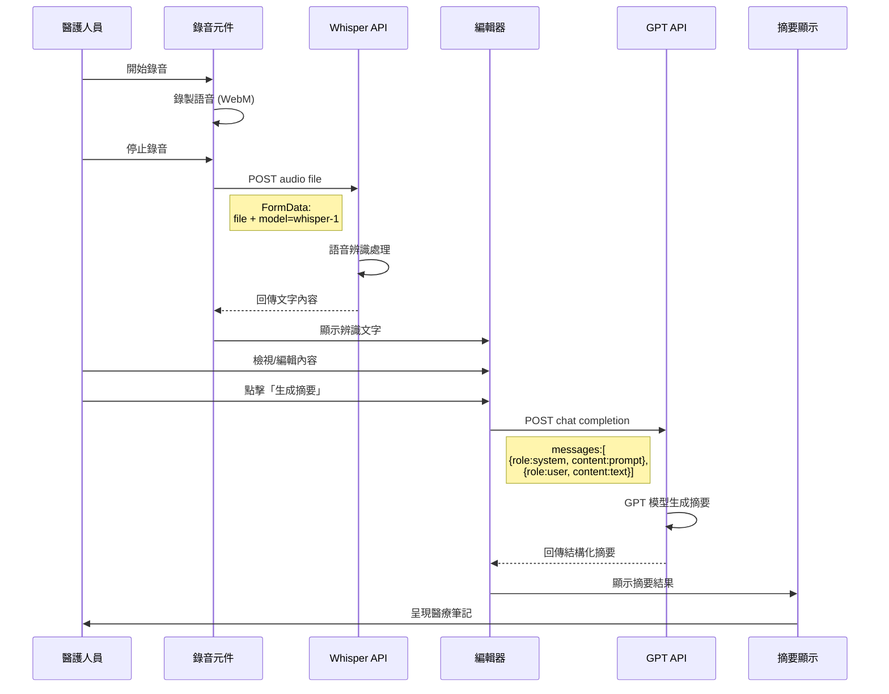
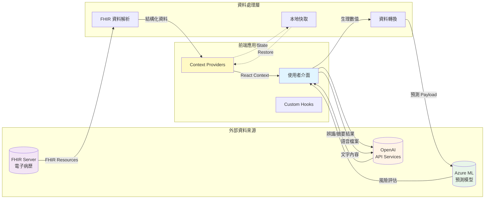

# AI即時敗血症風險預測系統 (Sepsis Risk Prediction System)

## 專案簡介

敗血症可能導致器官功能衰竭與危及生命。本系統透過病患的生理監測資訊,即時預測是否有敗血症風險。此模型的特點是不需檢驗數值,僅使用生理監測數值(心率、呼吸率、體溫、血氧、血壓)進行預測,大幅縮短診斷時間,為黃金搶救時刻爭取寶貴時間。

本專案基於 **SMART on FHIR** 國際標準,整合 **Next.js App Router**、**shadcn/ui (Radix)** 和 **fhirclient** 函式庫,提供標準化的醫療資訊交換介面。系統可從符合 FHIR 標準的電子病歷系統中讀取病患資料,並提供 AI 敗血症風險預測、醫療筆記語音辨識與 GPT 摘要生成等功能。

---

## 目錄 (Table of Contents)

1. [功能概述](#功能概述-feature-overview)
   - [核心功能](#核心功能)
   - [業務價值](#業務價值)
   - [技術特點](#技術特點)
2. [功能模組詳細說明](#功能模組詳細說明-feature-modules)
3. [技術架構](#技術架構-technical-architecture)
4. [API 串接說明](#api-串接說明-api-integration)
5. [系統需求](#系統需求-prerequisites)
6. [安裝與執行](#安裝與執行-install--run)
7. [SMART Sandbox 整合設定](#smart-sandbox-整合設定-smart-sandbox-integration)
8. [線上展示](#線上展示-online-demo)
9. [專案結構](#專案結構-project-structure)
10. [開發團隊](#開發團隊-development-team)
11. [致謝](#致謝-credits)
12. [授權](#授權-license)
13. [聯絡資訊](#聯絡資訊-contact)

---

## 功能概述 (Feature Overview)

### 核心功能

本系統整合 AI 預測、臨床資料管理與智慧文書處理,提供完整的敗血症風險評估解決方案:

- **AI 即時敗血症風險預測**: 使用深度學習模型分析生理監測數值,數秒內完成敗血症風險評估,支援排程自動預測與歷史趨勢追蹤
- **臨床資料總覽**: 整合呈現病患基本資料、生命徵象、診斷、檢驗報告、用藥與過敏史等完整臨床資訊
- **醫療筆記智慧生成**: 結合 Whisper 語音辨識與 GPT 摘要技術,自動將口述內容轉換為結構化醫療筆記
- **資料篩選與選擇**: 提供多維度臨床資料篩選工具,支援依類型、時間範圍等條件快速定位所需資訊
- **SMART on FHIR 整合**: 完整實作國際標準,可與任何符合 FHIR R4 的電子病歷系統無縫整合

### 業務價值

- **提升臨床照護品質**: 相較傳統血液培養需 24-72 小時,本系統數秒內完成風險評估,大幅縮短診斷時間,提升病患存活率
- **優化醫療工作流程**: 整合資訊呈現與智能摘要功能可節省 30-50% 文書時間,讓醫護人員專注於病患照護
- **促進醫療資訊互通**: 採用 FHIR 國際標準,降低跨院系統整合成本,並預留支援台灣核心實作指引(TW Core IG)擴充空間
- **降低醫療成本**: 早期辨識高風險病患可減少病情惡化,降低加護病房使用率與整體醫療費用

### 技術特點

- **先進 AI 技術**: 深度學習模型部署於 Azure 雲端平台,提供低延遲(<1秒)即時預測,自動處理 LOINC 標準編碼的生命徵象數據
- **現代化技術棧**: 採用 Next.js 15、React 19、TypeScript 5 與 Tailwind CSS 4,提供高效能、強型別與響應式的使用者介面
- **符合國際標準**: 完整支援 HL7 FHIR R4 與 SMART on FHIR,採用 OAuth 2.0 PKCE 安全授權機制
- **企業級安全**: 零信任架構、HTTPS 全程加密、CORS 跨域保護,確保醫療資料安全性
- **優質使用體驗**: 響應式設計支援多裝置,提供繁體中文與英文雙語介面,符合無障礙網頁標準(WCAG 2.1)
- **高度可擴展**: 模組化設計與元件驅動開發,易於維護與擴充新功能

---

## 功能模組詳細說明 (Feature Modules)

### 1. AI 即時敗血症風險預測
- **即時風險評估**: 使用 AI 模型分析生理監測數值,即時預測敗血症風險
- **排程自動預測**: 支援定時自動執行風險評估,持續追蹤病患風險變化
- **預測歷史記錄**: 完整記錄每次預測結果與時間戳記,提供趨勢分析
- **統計彙整**: 自動統計正常/高風險預測次數,協助醫療決策
- **無需侵入性檢驗**: 僅使用生理監測數值(HR、RR、Temp、SpO₂、SBP/DBP),無需等待血液檢驗報告
- **LOINC 標準編碼**: 採用國際標準 LOINC 編碼識別生命徵象,確保語意一致性

### 2. 臨床資料總覽 (Clinical Summary)
- **病患基本資料**: 顯示姓名、性別、年齡、出生日期等基本資訊
- **生命徵象監測**: 即時顯示心率、呼吸率、體溫、血氧、血壓等生理數值
- **診斷紀錄**: 完整呈現病患診斷資訊,包含診斷代碼、描述、臨床狀態
- **檢驗報告**: 整合實驗室檢驗數據與診斷報告,支援展開查看詳細觀察值
- **用藥資訊**: 顯示病患目前用藥清單,包含藥物名稱、劑量、用藥途徑
- **過敏史**: 記錄藥物與物質過敏資訊,避免醫療風險

### 3. 醫療筆記與語音辨識 (Medical Note)
- **語音錄製**: 支援瀏覽器內錄音功能,方便醫護人員口述記錄
- **Whisper 語音辨識**: 整合 OpenAI Whisper API,自動將語音轉換為文字
- **GPT 智能摘要**: 使用 GPT 模型自動生成結構化醫療筆記摘要
- **自訂 Prompt 編輯器**: 支援自訂 GPT 摘要生成提示詞,彈性調整輸出格式
- **API Key 管理**: 安全儲存 OpenAI API Key 於瀏覽器本地儲存空間

### 4. 資料選擇與篩選 (Data Selection)
- **多維度資料篩選**: 支援依資料類型(診斷/用藥/過敏/檢驗/觀察值)進行篩選
- **時間範圍過濾**: 可指定日期區間,精準定位所需臨床資料
- **彈性選擇介面**: 提供友善的資料選擇介面,支援批次選取與取消
- **即時資料更新**: 資料選擇狀態即時同步,方便後續分析使用

### 5. SMART on FHIR 標準整合
- **OAuth 2.0 PKCE 授權**: 完整實作 SMART on FHIR 啟動與授權流程 (`/smart/launch` → `/smart/callback`)
- **FHIR RESTful API**: 透過標準 FHIR API 讀取 Patient、Observation、Condition、MedicationRequest 等資源
- **多語言支援**: 提供繁體中文與英文雙語介面,符合國際化需求
- **跨平台相容**: 可與任何符合 FHIR R4 標準的電子病歷系統整合

---

## 技術架構 (Technical Architecture)

### 前端技術棧
- **Next.js 15**: React 全端框架,採用 App Router 架構
- **React 19**: 最新版本的 React 函式庫
- **TypeScript 5**: 強型別語言,提升程式碼品質與可維護性
- **Tailwind CSS 4**: 實用優先的 CSS 框架
- **shadcn/ui**: 基於 Radix UI 的高品質元件庫
- **fhirclient**: SMART on FHIR JavaScript 客戶端函式庫

### 後端服務
- **Azure Cloud Platform**: AI 預測模型部署於 Azure 雲端平台
- **RESTful API**: 提供標準化的 HTTP API 端點
- **Prediction Endpoint**: `https://sepsissmartonfhir-amhgcnfacgejhqhr.centralus-01.azurewebsites.net/api/sepsis`

### FHIR 資源支援
本系統支援以下 FHIR R4 資源類型:
- **Patient**: 病患基本資料 (姓名、性別、出生日期等)
- **Observation**: 觀察值與生命徵象 (心率、呼吸率、體溫、血氧、血壓、實驗室檢驗等)
- **Condition**: 診斷與健康狀況
- **MedicationRequest**: 用藥處方
- **AllergyIntolerance**: 過敏與不耐受資訊
- **DiagnosticReport**: 診斷報告

### LOINC 編碼對照表
生命徵象採用以下 LOINC 編碼:
| 生命徵象 | LOINC Code | 說明 |
|---------|-----------|------|
| 心率 (HR) | 8867-4 | Heart rate |
| 呼吸率 (RR) | 9279-1 | Respiratory rate |
| 體溫 (Temp) | 8310-5, 8320-5, 8331-1 | Body temperature |
| 血氧 (SpO₂) | 59408-5 | Oxygen saturation |
| 收縮壓 (SBP) | 8480-6 | Systolic blood pressure |
| 舒張壓 (DBP) | 8462-4 | Diastolic blood pressure |

### 資料安全性
- **OAuth 2.0 PKCE**: 符合 SMART on FHIR 安全規範的授權機制
- **本地儲存**: API Key 與使用者偏好設定儲存於瀏覽器本地
- **HTTPS 加密**: 所有 API 通訊使用 HTTPS 加密傳輸
- **最小權限原則**: 僅請求必要的 FHIR 資源存取權限

---

## API 串接說明 (API Integration)

本系統整合多個外部 API 服務,包含 FHIR 電子病歷系統、AI 預測服務與 OpenAI API。以下詳細說明各 API 的串接方式、請求格式與回應處理。

### 1. FHIR RESTful API

#### 概述
透過 `fhirclient` 函式庫與符合 FHIR R4 標準的電子病歷系統進行資料交換。

#### 初始化 FHIR Client
```typescript
// lib/providers/PatientProvider.tsx
import FHIR from 'fhirclient'

const client = await FHIR.oauth2.ready()
```

#### Patient 資源查詢
**用途**: 取得病患基本資料

```typescript
// 自動從 OAuth context 取得當前病患
const patient = await client.patient.read()

// 回應格式
{
  resourceType: "Patient",
  id: "patient-123",
  name: [{
    given: ["John"],
    family: "Doe"
  }],
  gender: "male",
  birthDate: "1980-01-01"
}
```

#### Observation 資源查詢
**用途**: 取得生命徵象與檢驗數據

```typescript
// lib/providers/ClinicalDataProvider.tsx

// 查詢生命徵象 (Vital Signs)
const vitals = await client.request(
  `Observation?patient=${patientId}&category=vital-signs&_sort=-date&_count=200`
)

// 查詢實驗室檢驗 (Laboratory)
const labs = await client.request(
  `Observation?patient=${patientId}&category=laboratory&_count=200&_sort=-date`
)

// 回應格式
{
  resourceType: "Bundle",
  type: "searchset",
  entry: [{
    resource: {
      resourceType: "Observation",
      id: "obs-123",
      status: "final",
      category: [{
        coding: [{
          system: "http://terminology.hl7.org/CodeSystem/observation-category",
          code: "vital-signs"
        }]
      }],
      code: {
        coding: [{
          system: "http://loinc.org",
          code: "8867-4",
          display: "Heart rate"
        }]
      },
      valueQuantity: {
        value: 80,
        unit: "beats/minute"
      },
      effectiveDateTime: "2024-01-09T10:30:00Z"
    }
  }]
}
```

#### Condition 資源查詢
**用途**: 取得診斷紀錄

```typescript
// 依記錄日期排序查詢
const conditions = await client.request(
  `Condition?patient=${patientId}&_sort=-recorded-date&_count=100`
)

// 若排序失敗,使用不排序查詢作為 fallback
const conditions = await client.request(
  `Condition?patient=${patientId}&_count=100`
)
```

#### MedicationRequest 資源查詢
**用途**: 取得用藥處方

```typescript
const medications = await client.request(
  `MedicationRequest?patient=${patientId}&_sort=-authoredon&_count=100`
)
```

#### AllergyIntolerance 資源查詢
**用途**: 取得過敏史

```typescript
const allergies = await client.request(
  `AllergyIntolerance?patient=${patientId}&_count=100`
)
```

#### DiagnosticReport 資源查詢
**用途**: 取得診斷報告與相關檢驗結果

```typescript
// 使用 _include 參數一次取得報告及其關聯的觀察值
const reports = await client.request(
  `DiagnosticReport?patient=${patientId}&_count=50&_sort=-date` +
  `&_include=DiagnosticReport:result` +
  `&_include:iterate=Observation:has-member`
)
```

#### 查詢參數說明

| 參數 | 說明 | 範例 |
|------|------|------|
| `patient` | 指定病患 ID | `patient=123` |
| `category` | 資源分類 | `category=vital-signs` |
| `_sort` | 排序欄位 | `_sort=-date` (降序) |
| `_count` | 回傳筆數限制 | `_count=100` |
| `_include` | 包含關聯資源 | `_include=DiagnosticReport:result` |
| `_include:iterate` | 遞迴包含關聯 | `_include:iterate=Observation:has-member` |

---

### 2. 敗血症預測 API

#### API 端點
```
POST https://sepsissmartonfhir-amhgcnfacgejhqhr.centralus-01.azurewebsites.net/api/sepsis
```

#### 請求格式
**Headers:**
```http
Content-Type: application/json
```

**Body:**
```json
[
  {
    "id": "patient-123-2024-01-09",
    "age": 45,
    "gender": 1,
    "hr": 85,
    "tp": 37.2,
    "spo2": 98,
    "sbp": 120,
    "dbp": 80,
    "resp": 16
  }
]
```

#### 請求參數說明

| 欄位 | 型別 | 說明 | 範例 |
|------|------|------|------|
| `id` | string | 唯一識別碼 | `"patient-123-2024-01-09"` |
| `age` | number\|null | 年齡 | `45` |
| `gender` | number\|null | 性別 (0=女, 1=男) | `1` |
| `hr` | number\|null | 心率 (Heart Rate) | `85` |
| `tp` | number\|null | 體溫 (Temperature) | `37.2` |
| `spo2` | number\|null | 血氧濃度 (SpO₂) | `98` |
| `sbp` | number\|null | 收縮壓 | `120` |
| `dbp` | number\|null | 舒張壓 | `80` |
| `resp` | number\|null | 呼吸率 (Respiratory Rate) | `16` |

#### 回應格式
```json
{
  "processed_data": [
    {
      "id": "patient-123-2024-01-09",
      "sepsis": 0
    }
  ],
  "error_data": []
}
```

**回應欄位說明:**

| 欄位 | 型別 | 說明 |
|------|------|------|
| `processed_data` | array | 成功處理的預測結果陣列 |
| `processed_data[].id` | string | 請求中提供的唯一識別碼 |
| `processed_data[].sepsis` | number | 預測結果 (0=正常, 1=高風險) |
| `error_data` | array | 處理失敗的資料陣列 |

#### 預測結果說明

| 值 | 意義 | 建議行動 |
|----|------|----------|
| `0` | 正常 (無敗血症風險) | 持續監測生命徵象 |
| `1` | 高風險 (可能有敗血症) | 建議立即進行臨床評估與相關檢驗 |

#### 實作範例
```typescript
// features/sepsis-risk/Feature.tsx

async function fetchPrediction(payload: ModelPayloadItem[], signal?: AbortSignal) {
  const headers: Record<string, string> = {
    "Content-Type": "application/json"
  }

  const res = await fetch(
    "https://sepsissmartonfhir-amhgcnfacgejhqhr.centralus-01.azurewebsites.net/api/sepsis",
    {
      method: "POST",
      headers,
      body: JSON.stringify(payload),
      signal, // 支援取消請求
    }
  )

  const text = await res.text()

  if (!res.ok) {
    throw new Error(`預測失敗 (${res.status}): ${text.slice(0, 200)}`)
  }

  const data = JSON.parse(text)
  const prediction = data?.processed_data?.[0]?.sepsis ?? null

  return { prediction, raw: data }
}
```

#### 錯誤處理
```typescript
try {
  const result = await fetchPrediction(payload, abortController.signal)
  setPrediction(result.prediction)
} catch (err) {
  if (err instanceof DOMException && err.name === "AbortError") {
    // 使用者取消請求
    return
  }
  // 其他錯誤處理
  console.error("預測錯誤:", err)
  setPredictionError(err.message)
}
```

---

### 3. OpenAI Whisper API (語音轉文字)

#### API 端點
```
POST https://api.openai.com/v1/audio/transcriptions
```

#### 請求格式
**Headers:**
```http
Authorization: Bearer YOUR_API_KEY
```

**Body (multipart/form-data):**
```
file: [audio file binary]
model: whisper-1
```

#### 實作範例
```typescript
// features/medical-note/components/AsrPanel.tsx

async function handleWhisperRequest(audioBlob: Blob) {
  const formData = new FormData()
  formData.append("file", audioBlob, "audio.webm")
  formData.append("model", "whisper-1")

  const response = await fetch(
    "https://api.openai.com/v1/audio/transcriptions",
    {
      method: "POST",
      headers: {
        Authorization: `Bearer ${apiKey}`
      },
      body: formData,
    }
  )

  const result = await response.json()
  const transcription = result?.text || ""

  return transcription
}
```

#### 回應格式
```json
{
  "text": "病患主訴頭痛三天,伴隨發燒症狀,體溫最高達攝氏三十八點五度。"
}
```


### 4. OpenAI Chat Completions API (GPT 摘要)

#### API 端點
```
POST https://api.openai.com/v1/chat/completions
```

#### 請求格式
**Headers:**
```http
Content-Type: application/json
Authorization: Bearer YOUR_API_KEY
```

**Body:**
```json
{
  "model": "gpt-4.1",
  "messages": [
    {
      "role": "system",
      "content": "你是專業的醫療記錄助理,請將以下內容整理成結構化的醫療筆記。"
    },
    {
      "role": "user",
      "content": "病患主訴頭痛三天,伴隨發燒症狀..."
    }
  ],
  "temperature": 0.7,
  "stream": false
}
```

#### 實作範例
```typescript
// features/medical-note/hooks/useGptQuery.ts

async function queryGpt(messages: GptMessage[], customModel?: string) {
  const controller = new AbortController()
  const timeoutId = setTimeout(() => {
    controller.abort("請求逾時")
  }, 60000) // 60秒逾時

  try {
    const response = await fetch(
      "https://api.openai.com/v1/chat/completions",
      {
        method: "POST",
        signal: controller.signal,
        headers: {
          "Content-Type": "application/json",
          "Authorization": `Bearer ${apiKey}`
        },
        body: JSON.stringify({
          model: customModel || "gpt-4.1",
          messages: [...initialMessages, ...messages],
          temperature: 0.7,
          stream: false
        })
      }
    )

    if (!response.ok) {
      const errorData = await response.json()
      throw new Error(errorData.error?.message || "API 請求失敗")
    }

    const data = await response.json()
    const content = data.choices[0]?.message?.content

    return content
  } finally {
    clearTimeout(timeoutId)
  }
}
```

#### 回應格式
```json
{
  "id": "chatcmpl-123",
  "object": "chat.completion",
  "created": 1677652288,
  "model": "gpt-4.1",
  "choices": [{
    "index": 0,
    "message": {
      "role": "assistant",
      "content": "## 主訴\n頭痛三天\n\n## 現病史\n伴隨發燒症狀,體溫最高達 38.5°C\n\n## 評估與計畫\n建議進行理學檢查與血液檢驗..."
    },
    "finish_reason": "stop"
  }],
  "usage": {
    "prompt_tokens": 56,
    "completion_tokens": 100,
    "total_tokens": 156
  }
}
```

#### 模型參數說明

| 參數 | 說明 | 預設值 |
|------|------|--------|
| `model` | 使用的模型 | `gpt-4.1` |
| `temperature` | 回應創造性 (0-2) | `0.7` |
| `stream` | 是否串流回應 | `false` |
| `max_tokens` | 最大回應長度 | 未設定 (使用模型預設) |

---

### API 錯誤處理策略

#### 1. 網路錯誤處理
```typescript
try {
  const response = await fetch(apiUrl, options)
  if (!response.ok) {
    throw new Error(`HTTP ${response.status}: ${response.statusText}`)
  }
} catch (error) {
  if (error instanceof TypeError) {
    // 網路連線問題
    console.error("網路連線失敗,請檢查網路狀態")
  }
}
```

#### 2. 逾時控制
```typescript
const controller = new AbortController()
const timeoutId = setTimeout(() => controller.abort(), 60000)

try {
  const response = await fetch(url, {
    signal: controller.signal
  })
} catch (error) {
  if (error.name === 'AbortError') {
    console.error("請求逾時")
  }
} finally {
  clearTimeout(timeoutId)
}
```

#### 3. 重試機制
```typescript
async function fetchWithRetry(url: string, options: RequestInit, maxRetries = 3) {
  for (let i = 0; i < maxRetries; i++) {
    try {
      const response = await fetch(url, options)
      if (response.ok) return response

      // 5xx 錯誤才重試
      if (response.status >= 500 && i < maxRetries - 1) {
        await new Promise(resolve => setTimeout(resolve, 1000 * (i + 1)))
        continue
      }

      throw new Error(`HTTP ${response.status}`)
    } catch (error) {
      if (i === maxRetries - 1) throw error
    }
  }
}
```

#### 4. API Key 驗證
```typescript
// lib/providers/ApiKeyProvider.tsx
const validateApiKey = (key: string): boolean => {
  if (!key || key.trim().length === 0) {
    throw new Error("API Key 不可為空")
  }
  if (!key.startsWith("sk-")) {
    throw new Error("無效的 OpenAI API Key 格式")
  }
  return true
}
```

---

### API 呼叫最佳實踐

1. **使用 AbortController 支援取消請求**
   ```typescript
   const controller = new AbortController()
   fetch(url, { signal: controller.signal })
   // 需要時: controller.abort()
   ```

2. **適當的錯誤訊息處理**
   - 解析 API 錯誤回應,提供友善的錯誤訊息
   - 區分網路錯誤、伺服器錯誤與業務邏輯錯誤

3. **載入狀態管理**
   - 使用 `isLoading` state 顯示載入指示器
   - 防止重複提交 (disabled button during loading)

4. **敏感資料保護**
   - API Key 儲存於瀏覽器 localStorage
   - 不透過伺服器中轉,直接從瀏覽器呼叫 API
   - 不將 API Key 寫入 Git repository

5. **請求去重與快取**
   - 使用 React Query 或 SWR 進行請求快取
   - 避免短時間內重複請求相同資源

---

## 系統需求 (Prerequisites)
- Node.js **18.18+** 或 **20.x LTS**
- npm / pnpm / yarn (範例使用 npm)
- 現代瀏覽器 (Chrome, Firefox, Safari, Edge 最新版本)

---

## 安裝與執行 (Install & Run)

### 本地開發環境

```bash
# 安裝相依套件
npm install

# 啟動開發伺服器 (使用 webpack,推薦用於本專案)
npm run dev:webpack

# 啟動開發伺服器 (使用 Turbopack,實驗性功能)
npm run dev

# 建置正式版本
npm run build

# 啟動正式版伺服器
npm start
```

### 可用腳本說明

```json
{
  "scripts": {
    "dev": "next dev --turbopack",           // Turbopack 開發模式 (實驗性)
    "dev:webpack": "next dev",               // Webpack 開發模式 (推薦)
    "build": "next build --turbopack",       // 建置正式版本
    "start": "next start",                   // 啟動正式版伺服器
    "build:gh": "GITHUB_PAGES=true next build", // GitHub Pages 建置
    "deploy": "npm run build:gh && gh-pages -d out -b gh-pages -t true" // 部署至 GitHub Pages
  }
}
```

**開發建議**: 開發期間使用 `npm run dev:webpack`,Turbopack 功能尚在實驗階段。

---

## SMART Sandbox 整合設定 (SMART Sandbox Integration)

### 步驟 1: 啟動本地開發伺服器

```bash
npm run dev:webpack
```

開發伺服器將在 http://localhost:3000 啟動

### 步驟 2: 設定 SMART App Launcher

在 SMART App Launcher 或您的沙盒應用程式註冊中,設定以下參數:

| 設定項目 | 設定值 |
|---------|--------|
| **Launch URL** | `http://localhost:3000/smart/launch` |
| **Redirect URL** | `http://localhost:3000/smart/callback` |
| **Client Type** | Public (PKCE) |
| **Client ID** | `my_web_app` (或您註冊的 Client ID) |
| **Scopes** | `launch openid fhirUser patient/*.read online_access` |

### 步驟 3: 啟動應用程式

1. 從 SMART Launcher 啟動應用程式
2. 完成 OAuth 授權流程
3. 系統自動重新導向至應用程式主頁
4. 病患資料自動載入並顯示於介面

### 重要提醒

⚠️ **請勿直接重新整理 `/smart/callback` 頁面**,這會導致授權流程失敗。正確流程必須從 `/smart/launch` 開始啟動。

### FHIR 授權範圍說明

| Scope | 說明 |
|-------|------|
| `launch` | 允許應用程式從 EHR 系統啟動 |
| `openid` | 取得使用者身分識別資訊 |
| `fhirUser` | 取得當前 FHIR 使用者資訊 |
| `patient/*.read` | 讀取病患所有 FHIR 資源 |
| `online_access` | 維持在線存取權限 |

---

## 線上展示 (Online Demo)

### SMART Health IT Launcher

本系統已部署至 GitHub Pages,可透過 SMART Health IT 官方沙盒環境進行測試。

- **SMART Launcher**: https://launch.smarthealthit.org/

- **App Demo Launch URL**:
  https://launch.smarthealthit.org/?launch_url=https%3A%2F%2Fkaichen0712.github.io%2FSepsis_prediction_smartonfhir%2Fsmart%2Flaunch&launch=WzAsIiIsIiIsIkFVVE8iLDAsMCwwLCIiLCIiLCIiLCIiLCIiLCIiLCIiLDAsMSwiIl0

### 使用說明

1. 點擊上方 App Demo Launch URL
2. 在 SMART Launcher 介面中選擇病患
3. 點擊 "Launch App" 按鈕
4. 完成授權後即可進入系統並查看病患資料與敗血症風險預測

---

## 系統架構圖 (System Architecture)

### 元件架構圖



### 系統流程圖

#### 1. SMART on FHIR 啟動流程



#### 2. 敗血症風險預測流程



#### 3. 醫療筆記生成流程



#### 4. 資料流向圖



---

## 專案結構 (Project Structure)

```
Sepsis_prediction_smartonfhir/
├── app/                          # Next.js App Router 應用程式目錄
│   ├── page.tsx                  # 主頁面
│   ├── layout.tsx                # 根版面配置
│   └── smart/                    # SMART on FHIR 相關路由
│       ├── launch/               # OAuth 啟動端點
│       └── callback/             # OAuth 回呼端點
├── features/                     # 功能模組
│   ├── sepsis-risk/              # 敗血症風險預測
│   │   └── Feature.tsx           # 主要功能元件
│   ├── clinical-summary/         # 臨床資料總覽
│   │   ├── Feature.tsx           # 主要功能元件
│   │   └── components/           # 子元件 (病患資訊、生命徵象、診斷等)
│   ├── medical-note/             # 醫療筆記
│   │   ├── Feature.tsx           # 主要功能元件
│   │   ├── components/           # 語音辨識、GPT 摘要等元件
│   │   └── providers/            # Note Provider
│   ├── data-selection/           # 資料選擇與篩選
│   │   ├── Feature.tsx           # 主要功能元件
│   │   ├── components/           # 資料選擇面板
│   │   └── hooks/                # 資料選擇 Hook
│   └── right-panel/              # 右側面板整合
│       └── Feature.tsx           # 標籤頁整合元件
├── lib/                          # 共用函式庫
│   ├── providers/                # React Context Providers
│   │   ├── PatientProvider.tsx  # 病患資料提供者
│   │   ├── ClinicalDataProvider.tsx # 臨床資料提供者
│   │   └── LanguageProvider.tsx # 語言設定提供者
│   └── i18n/                     # 國際化設定
│       └── translations/         # 翻譯檔案 (zh-TW, en-US)
├── components/                   # 共用 UI 元件
│   └── ui/                       # shadcn/ui 元件
├── public/                       # 靜態資源
│   └── icon.png                  # 應用程式圖示
└── package.json                  # 專案設定檔
```

---

## 開發團隊 (Development Team)

- **孫英洲**: 團隊主持人
- **郭宜欣**: 核心程式提供
- **黃凱辰**: 本專案開發
- **詹彥杰**: 技術支援

---

## 致謝 (Credits)

本專案核心是基於郭宜欣醫師的「medical-note-smart-on-fhir」專案修改而成,並擴展加入敗血症風險預測、臨床資料整合等功能。

**原專案連結**: https://github.com/voho0000/medical-note-smart-on-fhir/tree/master

---

## 授權 (License)

本專案採用開放原始碼授權,詳細授權條款請參考原專案授權聲明。

---

## 聯絡資訊 (Contact)

如有任何問題或建議,歡迎透過 GitHub Issues 或直接聯繫開發團隊。

**GitHub Repository**: https://github.com/kaichen0712/Sepsis_prediction_smartonfhir